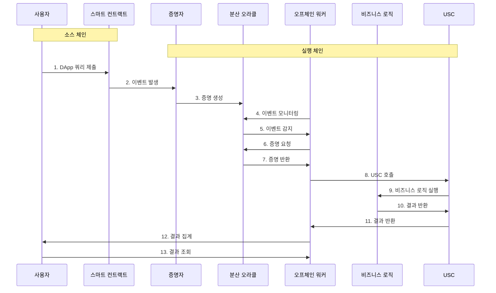
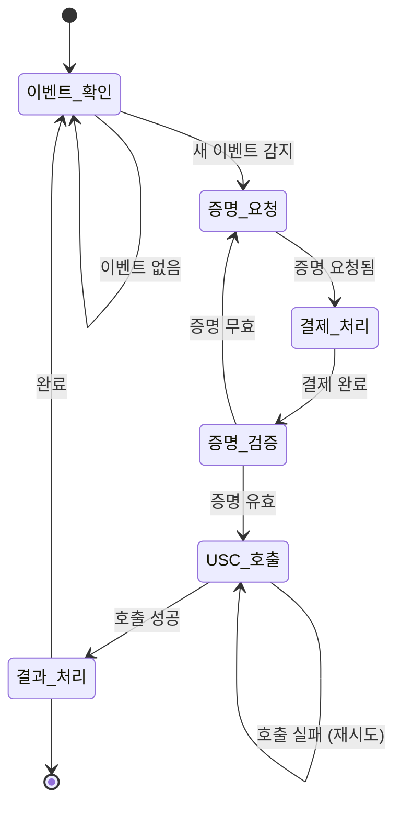

# 오프체인 오라클 워커

> **오래된 문서:** 이 문서는 이전 버전의 USC 테스트넷에 대한 문서입니다. 최신 문서는 다음을 방문하세요: [[USC/소개|usc 문서]]

## 오프체인 오라클 워커의 필요성

Creditcoin 오라클이 한 체인에서 다른 체인으로 데이터를 제공할 때, 사용자 또는 DApp 빌더가 제출해야 하는 **세 가지** 트랜잭션이 있습니다:

1. **사용자가 소스 체인에서 트랜잭션을 제출합니다**. 일반적으로 이것은 *소스 체인* 스마트 컨트랙트 호출로, *실행 체인*으로 데이터를 전송하려는 `이벤트`를 발생시킵니다.
2. **사용자/빌더가 Creditcoin 실행 체인에서 오라클 쿼리를 제출합니다**. 이 트랜잭션은 쿼리 증명 프로세스를 시작합니다. 쿼리 증명 후, 1단계에서 발생한 이벤트의 데이터가 증명되어 *실행 체인*에서 사용 가능해집니다.
3. **사용자/빌더가 실행 체인에서 유니버설 스마트 컨트랙트를 호출합니다**. 이 호출은 1단계에서 발생하고 2단계에서 Creditcoin 오라클에 의해 사용 가능해진 이벤트 데이터를 가져옵니다. 유니버설 스마트 컨트랙트가 이를 해석하고, [[USC/USC-v1/DApp-빌더-인프라/인프라-개요|비즈니스 로직 스마트 컨트랙트]]에서 DApp 비즈니스 로직을 트리거하는 데 사용합니다.

### 마찰 제거

첫 번째 트랜잭션은 항상 최종 사용자가 제출해야 합니다. 그러나 트랜잭션 2와 3은 DApp 빌더가 사용자를 대신하여 시작할 수 있습니다. 이것이 더 바람직한 이유는 다음과 같습니다:

1. **DApp이 사용자에게 서명을 요구하는 트랜잭션이 적을수록 좋습니다!** 하나의 트랜잭션에만 서명하는 것이 몇 분 간격으로 3개에 서명하는 것보다 훨씬 나은 경험입니다.
2. **최종 사용자는 왜 3개의 다른 트랜잭션에 서명해야 하는지 이해하지 못합니다.** 이것은 그들에게 불안감을 줄 수 있고, 심지어 일부 사용자가 DApp 사용을 포기하게 만들 수도 있습니다.
3. 오라클 쿼리 결과의 의미론적 레이블링 부족으로 인해, **잘못된 오라클 쿼리를 구성하는 것이 가능하며**, 이로 인해 DApp의 유니버설 스마트 컨트랙트와 호환되지 않을 수 있습니다. 이러한 이유로 DApp 빌더는 사용자를 대신하여 적절히 포맷된 쿼리를 제출해야 합니다.

## 오프체인 오라클 워커 설계

위에서 본 것처럼, 최종 사용자를 대신하여 *증명* 및 *쿼리* 트랜잭션에 서명하면 Creditcoin *실행 체인*에서 핵심 비즈니스 로직을 트리거하는 데 필요한 사용자 상호작용 횟수를 줄여 유니버설 DApp의 UX를 크게 개선할 수 있습니다.

### 워커 트랜잭션 흐름

실행 프로세스를 간소화하는 한 가지 방법은 다음 시퀀스 다이어그램에서 설명하는 것처럼 *자동화된 오프체인 워커*에 의존하는 것입니다.

이를 동일한 네 가지 범주로 나눌 수 있지만, UX 측면에서 다른 의미를 갖습니다:

* **소스 체인에서의 초기 DApp 쿼리.** 이제 최종 사용자가 서명해야 하는 유일한 트랜잭션입니다. DApp의 나머지 모든 로직은 오프체인 워커가 처리하여 진정한 네이티브 느낌을 제공합니다.
* **증명 생성.** **n˚4**에서 **n˚7** 단계는 *소스 체인*에서 이벤트 발생에 대한 증명을 생성하는 역할을 합니다. 오프체인 워커는 소스 체인 컨트랙트의 이벤트를 지속적으로 모니터링합니다. 이벤트가 발생하고 실행 체인에서 사용 가능해지면, Creditcoin 오라클에 증명을 요청합니다. *이것은 추가적인 사용자 상호작용이 필요하지 않습니다.*
* **비즈니스 로직 실행.** 다음으로, **n˚8**에서 **n˚13** 단계는 *실행 체인*에서 DApp의 비즈니스 로직을 실행하는 역할을 합니다. 이것은 오프체인 워커에 의해 시작되며, 사용자를 대신하여 *실행 체인*의 유니버설 스마트 컨트랙트를 쿼리합니다. *이것은 추가적인 사용자 상호작용이 필요하지 않습니다.*
* **결과 집계.** 마지막으로, DApp 실행 결과를 사용자가 검색하고 처리할 수 있습니다. 이것은 추가적인 사용자 상호작용이 필요하지 않지만, DApp 클라이언트가 라이트 클라이언트를 통해 또는 원격 RPC 엔드포인트를 쿼리하여 *실행 체인*을 모니터링해야 *합니다*.

### 더 나아가기

이것은 오프체인 워커 사용을 소개하기 위해 설계된 시작점일 뿐입니다. 각 DApp 빌더 팀은 자체 기술 스택의 나머지 부분에 맞게 워커를 다르게 구현하고 싶을 것입니다.

이를 염두에 두고, 오프체인 워커의 주요 목표는 항상 견고성이어야 합니다. 여기에는 다음이 포함됩니다:

1. 워커 종료 시 진행 중인 쿼리의 저장된 기록 유지.
2. 예기치 않은 종료로 인해 놓쳤을 수 있는 이벤트 따라잡기.
3. 동일한 이벤트에 대해 여러 쿼리 또는 USC 호출 제출 방지.
4. 노드에 문제가 발생할 경우를 대비하여 여러 소스 체인 노드를 팔로우하여 이벤트 수신.
5. 실패할 경우 유효한 오라클 쿼리 또는 USC 호출 재제출. 쿼리는 여러 가지 이유로 실패할 수 있습니다: 예를 들어 쿼리가 제출된 증명자가 다운타임이나 연결 문제를 겪고 있을 수 있습니다.

## 다음 단계

[[USC/USC-v1/DApp-빌더-인프라/USC-튜토리얼|USC 튜토리얼]]

오프체인 워커의 예시는 [이 스크립트](https://github.com/gluwa/ccnext-testnet-bridge-examples/blob/main/bridge-offchain-worker/src/worker.ts)를 확인하세요. [오라클 쿼리가 제출](https://github.com/gluwa/ccnext-testnet-bridge-examples/blob/b46a76e559cb4c7b1207567a8bf76f36db2f9430/bridge-offchain-worker/src/worker.ts#L237)되는 곳과 [쿼리 결과가 유니버설 스마트 컨트랙트에 제출](https://github.com/gluwa/ccnext-testnet-bridge-examples/blob/b46a76e559cb4c7b1207567a8bf76f36db2f9430/bridge-offchain-worker/src/worker.ts#L300)되는 곳을 확인할 수 있습니다.
