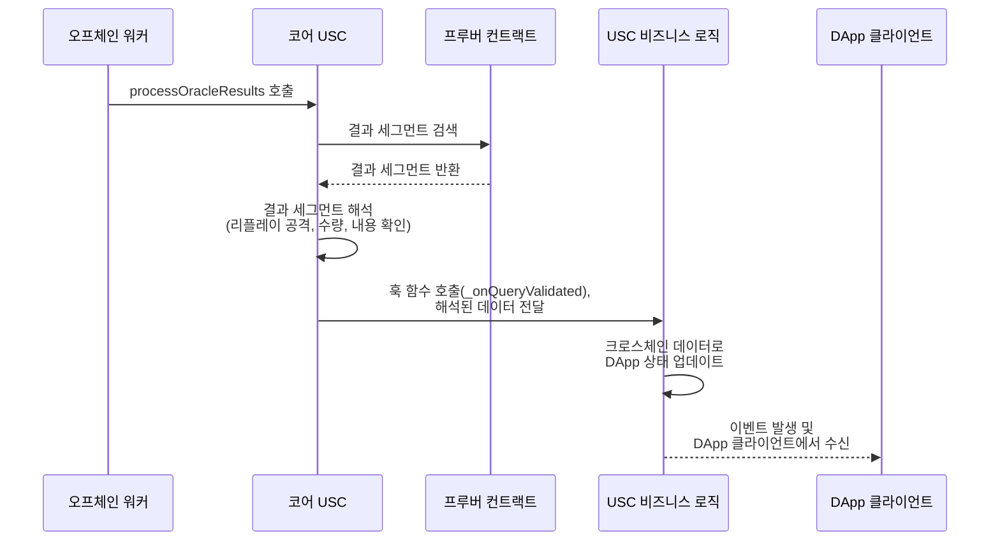

# 유니버설 스마트 컨트랙트

> [!danger] 오래된 문서
> 현재 보고 있는 문서는 이전 버전의 USC 테스트넷 문서입니다. 최신 문서는 다음을 참조하세요: [[USC/소개|USC 문서]]

## 유니버설 스마트 컨트랙트란?

**유니버설 스마트 컨트랙트**(USC)는 기존 스마트 컨트랙트에 크로스체인 기능을 확장하는 어댑터 역할을 합니다. 이를 통해 컨트랙트는 **Creditcoin 탈중앙화 오라클**을 통해 외부 블록체인의 데이터를 *쿼리*, *검색*, *검증*할 수 있습니다.

토큰 전송이나 특정 자산에 초점을 맞춘 기존의 옴니체인 또는 크로스체인 솔루션과 달리, USC는 **범용 실행 레이어**를 제공합니다. 이를 통해 컨트랙트는 *핵심 로직을 다시 작성할 필요 없이* 외부에서 검증된 데이터를 기반으로 작동할 수 있습니다. USC를 기술 스택에 도입함으로써 개발자는 자신의 컨트랙트를 원활한 크로스체인 데이터로 구동되는 *유니버설* 컴포넌트로 변환할 수 있으며, 여러 블록체인 간의 새로운 상호운용성 패턴을 구현할 수 있습니다.

## 유니버설 스마트 컨트랙트(USC) 구성요소

모범 사례로서, 유니버설 DApp의 기능을 최소 2개의 컨트랙트로 분리합니다:

1. **코어 USC 컨트랙트**: 사용자와 다른 컨트랙트가 신뢰 최소화 및 프로토콜 불가지론적 방식으로 **검증된 크로스체인 데이터를 쿼리하고 검색**할 수 있게 합니다.
2. **USC 비즈니스 로직 컨트랙트**: DApp의 커스텀 로직이 구현되는 곳입니다. 이 컨트랙트들은 코어 USC 컨트랙트가 새로운 크로스체인 데이터를 처리할 때 트리거되는 **훅 함수**를 포함합니다. **훅 함수**를 통해 크로스체인 데이터는 Creditcoin 오라클에서 코어 USC 컨트랙트를 거쳐 USC 비즈니스 로직 컨트랙트로 원활하게 전달되며, 여기서 DApp 로직을 트리거합니다. 이를 통해 빌더들은 다양한 탈중앙화 애플리케이션에 **USC 기능을 원활하게 통합**할 수 있습니다.

## 코어 USC 컨트랙트

코어 유니버설 스마트 컨트랙트에는 검증자에 의해 검증된 후 **프루버 컨트랙트**에서 데이터를 읽는 함수들이 포함되어 있습니다. USC 컨트랙트의 핵심 함수는 다음과 같습니다:

### 함수: isQueryUsed

```solidity
function isQueryUsed(
    address user,
    bytes32 queryId
) public view returns (bool) {
    // ...
}
```

**타입:** Public

특정 사용자의 주어진 `queryId`가 이미 처리되었는지 확인합니다. **리플레이 공격을 방지하기 위해 중복 쿼리는 거부됩니다.**

---

### 함수: _markQueryUsed

```solidity
function _markQueryUsed(address user, bytes32 queryId) internal {
    // ...
}
```

**타입:** Internal

주어진 사용자에 대해 `queryId`를 사용됨으로 표시합니다. 이를 통해 **쿼리가 처리되면 다시 실행될 수 없도록** 보장합니다.

---

### 함수: _processOracleResults

```solidity
function _processOracleResults(
    address proverContractAddr,
    bytes32 queryId
) internal returns(
    bytes32 functionSignature,
    ResultSegment[] memory eventSegments
) {
    // ...
}
```

**타입:** Internal

오라클 쿼리 결과를 처리하는 핵심 함수입니다:

* `queryId`가 이전에 사용되지 않았는지 검증합니다.
* **프루버 컨트랙트**에서 쿼리 세부정보를 검색합니다.
* 함수 시그니처와 이벤트 데이터(`ResultSegment[]`)를 추출합니다.
* 비즈니스 로직 컨트랙트에서 추가 처리를 위해 파싱된 데이터를 준비합니다.
* USC 비즈니스 로직 컨트랙트를 트리거하기 위해 `_onQueryValidated()` 훅 함수를 호출합니다.

---

### 함수: _onQueryValidated

```solidity
function _onQueryValidated(
    bytes32 queryId,
    bytes32 functionSignature,
    ResultSegment[] memory eventSegments
) internal virtual;
```

USC 비즈니스 로직 컨트랙트에서 구현되고 코어 USC 컨트랙트에서 호출되는 **훅 함수**입니다. 호출되면 새로운 크로스체인 데이터를 기반으로 DApp 특정 작업을 트리거합니다(예: 트랜잭션 실행, 상태 업데이트, 이벤트 트리거).

### 컨트랙트 코드

```solidity
// SPDX-License-Identifier: GPL-3.0
pragma solidity ^0.8.0;

import "@gluwa/creditcoin-public-prover/contracts/sol/Types.sol";
import {ICreditcoinPublicProver} from "@gluwa/creditcoin-public-prover/contracts/sol/Prover.sol";

abstract contract UniversalSmartContract_Core  {
    bytes32 private constant USCStorageLocation =
        0x6873a84df95308b16f5c8aa284ac06f406edc8315b9626bdacc9b42f5ee1d200;

    struct USCStorage {
        mapping(address => mapping(bytes32 => bool)) usedQueryId;
    }

    function _getUSCStorage() internal pure returns (USCStorage storage $) {
        assembly {
            $.slot := USCStorageLocation
        }
    }

    function isQueryUsed(
        address user,
        bytes32 queryId
    ) public view returns (bool) {
        return _getUSCStorage().usedQueryId[user][queryId];
    }

    function _markQueryUsed(address user, bytes32 queryId) internal {
        _getUSCStorage().usedQueryId[user][queryId] = true;
    }

    /// @notice Processes a query from the prover and extracts data, deferring
    /// action to child contract
    function _processOracleResults(
        address proverContractAddr,
        bytes32 queryId
    ) internal returns(
        bytes32 functionSignature,
        ResultSegment[] memory eventSegments
    ) {
        USCStorage storage $ = _getUSCStorage();
        require(
            !$.usedQueryId[proverContractAddr][queryId],
            "QueryId already used"
        );

        ICreditcoinPublicProver prover = ICreditcoinPublicProver(
            proverContractAddr
        );
        QueryDetails memory queryDetails = prover.getQueryDetails(queryId);
        ResultSegment[] memory resultSegments = queryDetails.resultSegments;

        require(resultSegments.length >= 8, "Invalid result length");
        functionSignature = resultSegments[4].abiBytes;

        uint256 resultLength = resultSegments.length;
        eventSegments = new ResultSegment[](resultLength - 5);
        for (uint256 i = 5; i < resultLength;) {
            eventSegments[i] = resultSegments[i];
            unchecked {
                ++i;
            }
        }

        // Hook validation logic for implementation contract to use
        _onQueryValidated(queryId, functionSignature, eventSegments);
    }

    /// @dev Must be implemented by child contract to handle validated data
    function _onQueryValidated(
        bytes32 queryId,
        bytes32 functionSignature,
        ResultSegment[] memory eventSegments
    ) internal virtual;
}
```

## 쿼리 처리 흐름

컨트랙트가 코어 컨트랙트를 통해 직접 또는 `USC` 비즈니스 로직 컨트랙트를 통해 유니버설 스마트 컨트랙트(`USC`)를 상속받으면, **다른 블록체인에서 검증된 데이터를 검색하고 해석**하는 기능을 얻게 됩니다. 이 데이터는 `ResultSegment[]` 형태의 표준화된 포맷으로 반환됩니다. 컨트랙트는 이러한 Result Segment를 사용하여 자체 비즈니스 로직에 따라 **현재 체인(목적지 체인)에서 어떤 작업을 수행할지 결정**할 수 있습니다.

아래는 Creditcoin 오라클 쿼리가 이미 처리되고 결과 세그먼트가 오라클의 `프루버 컨트랙트`에 저장된 후 USC에서 처리하는 이벤트 흐름입니다. 오프체인 워커는 완료된 오라클 쿼리를 감지하고 코어 USC의 메인 함수 `processOracleResults`를 트리거하여 USC 프로세스를 시작합니다.

### 시퀀스 다이어그램



## 결과 세그먼트

`ResultSegment`는 `USC` 쿼리에서 반환된 특정 정보를 나타내는 **ABI 인코딩된 데이터 단위**입니다. 결과 세그먼트는 쿼리가 대상으로 하는 전체 트랜잭션이나 이벤트를 구조화된 방식으로 설명하는 배열에 집합적으로 저장됩니다.

주요 특성:

* **ABI 인코딩:** 각 세그먼트는 Solidity 타입(예: `address`, `uint256`, `bool`)을 인코딩하는 원시 `bytes32`를 포함합니다. 사용자는 해당 `bytes32`를 대상 데이터 타입으로 다시 변환하여 값을 검색할 수 있습니다.
* **단일 값**: 각 세그먼트는 전체 트랜잭션이나 이벤트가 *아닌* **단일 데이터 조각**(예: 발신자 주소, 수신자 주소, 토큰 수량, 이벤트 시그니처)을 인코딩합니다.
* **관련 데이터의 시퀀스**: 결과 세그먼트는 배열에 저장되며, 배열에서의 위치가 데이터의 의미를 결정합니다.

> [!info] 정보
> `ResultSegment[]`는 `USC`가 쿼리하는 이벤트나 트랜잭션에 따라 다른 길이를 가질 수 있습니다.

* **결정론적:** 각 `ResultSegments[]` 배열에는 항상 이벤트 시그니처(이벤트 데이터 앞에)가 있으며, 구현 컨트랙트가 `ResultSegments[]`를 소비할 때 올바른 작업을 결정하는 데 사용됩니다.

### 예시 구조

다음은 `ERC-20` 소각 트랜잭션 이벤트(`address(0)`로의 전송)를 반환하는 쿼리의 Result Segment입니다:

```
0x0000000000000000000000000000000000000000000000000000000000000001
000000000000000000000000016e7bfe4a7213e18516ca0cb84cf2750d360b33
0000000000000000000000008928f05a197215ad7fffec1f0e4e9159e8c4c403
0000000000000000000000008928f05a197215ad7fffec1f0e4e9159e8c4c403
ddf252ad1be2c89b69c2b068fc378daa952ba7f163c4a11628f55a4df523b3ef
000000000000000000000000016e7bfe4a7213e18516ca0cb84cf2750d360b33
0000000000000000000000000000000000000000000000000000000000000001
0000000000000000000000000000000000000000000000000000000000000032
```

### 결과 세그먼트 해석 표

| 세그먼트 | 세그먼트 데이터 (Hex) | 설명 |
|---------|-------------------|-------------|
| `resultSegments[0]` | 0x0000000000000000000000000000000000000000000000000000000000000001 | 원본 트랜잭션 상태. |
| `resultSegments[1]` | 0x000000000000000000000000016e7bfe4a7213e18516ca0cb84cf2750d360b33 | 발신자 주소. |
| `resultSegments[2]` | 0x0000000000000000000000008928f05a197215ad7fffec1f0e4e9159e8c4c403 | 대상 컨트랙트 주소. |
| `resultSegments[3]` | 0x0000000000000000000000008928f05a197215ad7fffec1f0e4e9159e8c4c403 | 최종 컨트랙트 주소(이벤트를 발생시킨). **참고:** 대상 컨트랙트가 트랜잭션 실행을 위해 다른 컨트랙트와 상호작용할 때 최종 컨트랙트 주소와 대상 컨트랙트 주소가 다를 수 있습니다. |
| `resultSegments[4]` | 0xddf252ad1be2c89b69c2b068fc378daa952ba7f163c4a11628f55a4df523b3ef | 구현 컨트랙트가 작업을 결정하는 데 사용할 이벤트 시그니처. 이 경우 `Transfer(address,address,address)`입니다. |
| `resultSegments[5]` | 0x000000000000000000000000016e7bfe4a7213e18516ca0cb84cf2750d360b33 | 전송 이벤트의 `from` 주소. |
| `resultSegments[6]` | 0x0000000000000000000000000000000000000000000000000000000000000000 | 전송 이벤트의 `to` 주소. |
| `resultSegments[7]` | 0x0000000000000000000000000000000000000000000000000000000000000032 | 전송 이벤트의 `amount`. |

## USC 확장 컨트랙트

`USC`가 기존 컨트랙트에 쉽게 통합될 수 있도록 **USC Core** 위에 구축된 **확장 컨트랙트** 모음을 제공합니다. 이러한 확장은 `USC`의 기능을 다양한 실제 사용 사례에 맞게 조정하여 빌더들이 크로스체인 데이터를 자신의 로직에 원활하게 포함시킬 수 있게 합니다. 일반적인 사용 사례는 다음을 포함하지만 이에 국한되지 않습니다:

* **소각 후 민팅(Burn-and-Mint)**: 다른 체인의 소각 이벤트를 읽어 한 체인에서 새로운 토큰을 민팅하여 크로스체인 자산 전송을 가능하게 합니다.
* **잠금 후 민팅(Lock-and-Mint)**: 소스 체인의 잠금 이벤트를 기반으로 목적지 체인에서 토큰을 민팅합니다.
* **크로스체인 스왑(Cross-Chain Swap)**: 검증된 이벤트 데이터를 사용하여 서로 다른 블록체인에서 토큰 A를 토큰 B로 스왑합니다.
* **멀티체인 대출 집계(Multi-Chain Loan Aggregation)**: 신용 점수 및 인수를 위해 여러 체인의 상환 데이터를 집계합니다.

> [!info] 정보
> 빌더들은 동작을 완전히 커스터마이즈하고 USC 기능을 자신의 비즈니스 로직에 더 밀접하게 통합하려는 경우 **코어 USC 컨트랙트**와 직접 작업할 수도 있습니다.

### 아키텍처

```
┌─────────────────────────────────────────────────────────────────┐
│                     USC 확장 컨트랙트                            │
│  ┌─────────────┐ ┌─────────────┐ ┌─────────────┐ ┌────────────┐ │
│  │소각후민팅   │ │잠금후민팅   │ │크로스체인   │ │ 멀티체인   │ │
│  │             │ │             │ │   스왑      │ │ 대출집계   │ │
│  └─────────────┘ └─────────────┘ └─────────────┘ └────────────┘ │
└─────────────────────────────────────────────────────────────────┘
                              │
                              ▼
┌─────────────────────────────────────────────────────────────────┐
│                    코어 USC 컨트랙트                             │
│  ┌─────────────────────────────────────────────────────────────┐│
│  │ isQueryUsed | _markQueryUsed | _processOracleResults        ││
│  │                    _onQueryValidated (훅)                   ││
│  └─────────────────────────────────────────────────────────────┘│
└─────────────────────────────────────────────────────────────────┘
                              │
                              ▼
┌─────────────────────────────────────────────────────────────────┐
│                      프루버 컨트랙트                             │
└─────────────────────────────────────────────────────────────────┘
```

### 예시: MintableUSCBridge

```solidity
// SPDX-License-Identifier: GPL-3.0
pragma solidity ^0.8.0;

import "@gluwa/creditcoin-public-prover/contracts/sol/Types.sol";
import "@openzeppelin/contracts/token/ERC20/ERC20.sol";
import {UniversalSmartContract_Core} from "./UniversalSmartContract_Core.sol";

abstract contract MintableUSCBridge is UniversalSmartContract_Core, ERC20 {
    event TokensMinted(
        address indexed token,
        address indexed recipient,
        uint256 amount,
        bytes32 indexed queryId
    );

    error InvalidFunctionSignature();
    error InvalidSegmentLength();
    error ZeroAmount();
    error InvalidBurnAddress();
    error InvalidRecipient();
    error QueryAlreadyProcessed();

    bytes4 private constant TRANSFER_EVENT_SIG = 0xddf252ad;
    mapping(bytes32 => bool) public processedQueries;

    /// @notice Executes USC query processing and mints based on extracted
    /// Transfer event
    function mintFromQuery(
        address proverContractAddr,
        bytes32 queryId
    ) external {
        if (processedQueries[queryId]) revert QueryAlreadyProcessed();
        processedQueries[queryId] = true;

        // Get function signature and event data
        (
            bytes32 functionSig,
            ResultSegment[] memory eventSegments
        ) = _processUSCQuery(proverContractAddr, queryId);

        if (bytes4(functionSig) != TRANSFER_EVENT_SIG)
            revert InvalidFunctionSignature();
        if (eventSegments.length < 3) revert InvalidSegmentLength();

        address from = address(
            uint160(uint256(bytes32(eventSegments[0].abiBytes)))
        );
        address to = address(
            uint160(uint256(bytes32(eventSegments[1].abiBytes)))
        );
        uint256 amount = uint256(bytes32(eventSegments[2].abiBytes));

        if (amount == 0) revert ZeroAmount();
        if (to != address(0)) revert InvalidBurnAddress();
        if (from == address(0)) revert InvalidRecipient();

        // Mint tokens on destination chain
        _mint(from, amount);

        emit TokensMinted(address(this), from, amount, queryId);
    }

    function _toAddress(bytes memory data) internal pure returns (address) {
        return abi.decode(data, (address));
    }

    function _toUint256(bytes memory data) internal pure returns (uint256) {
        return abi.decode(data, (uint256));
    }

    function _onQueryValidated(
        bytes32,
        bytes32,
        ResultSegment[] memory
    ) internal virtual override {
        // 아래에 더 많은 함수...
    }

    // 아래에 더 많은 함수...
}
```

### 예시: YourToken 구현

```solidity
pragma solidity ^0.8.0;

import "@openzeppelin/contracts/token/ERC20/ERC20.sol";
import "./MintableUSCBridge.sol";

contract YourToken is ERC20, MintableUSCBridge {

    constructor(
        string memory name_,
        string memory symbol_
    ) ERC20(name_, symbol_) {
        // 여기에 생성자 비즈니스 로직이 들어갑니다...
    }

    function _onQueryValidated(
        bytes32,
        bytes32,
        ResultSegment[] memory
    ) internal override {
        // 여기에 비즈니스 로직이 들어갑니다...
    }

    // 아래에 더 많은 로직...

}
```

## 다음 단계

[[USC/USC-v1/DApp-빌더-인프라/DApp-디자인-패턴|DApp 디자인 패턴]]

*탈중앙화된 신뢰가 필요 없는 브릿지를 설정하기 위해 Creditcoin 스택을 사용하는 방법의 예시는 [이 튜토리얼](https://github.com/gluwa/ccnext-testnet-bridge-examples)을 참조하세요.*
